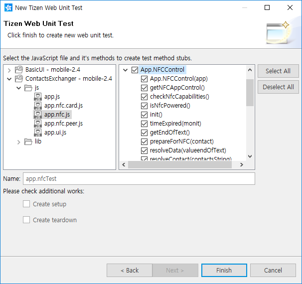
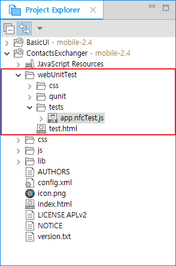
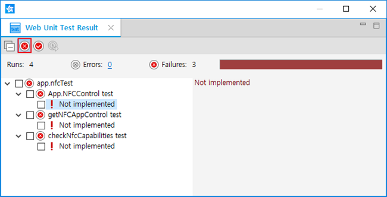
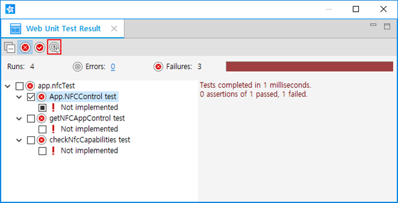

# Unit Testing Web Applications

If you are implementing a component in your application, you must test it to ensure that it does not behave in an unexpected way. Well-tested applications that perform as expected improve user satisfaction. Testing can also help you develop your applications faster and further, with less wasted effort.

## Creating the Web Unit Test

A unit of code is the smallest testable component of your project, such as a class or a method.

You can create unit tests easily with the Web Unit Test wizard.

To test your project:

1. To open the wizard, go to **File > New > Other > Tizen > Tizen Web Unit Test**.
2. Select the file to test from the file list on the left pane.
3. Select the methods to test from the method list on the right pane.
4. Enter a name for the test file, and click **Finish**.

**Figure: Creating a Web unit test**



The Web unit tests are generated in the `webUnitTest` folder.

**Figure: Web unit test location**



## Editing the Web Unit Test

To edit a unit test:

1. Add a test case using the `test()` function:
   ```
   test(name, test2);
   ```
   The function takes the following parameters:
   - `name`: Title of the test as a string, used to display the test results
   - `test2`: Function containing the actual testing code that is written with 1 or more assertions to test

2. Edit the `test2` parameter using assertions.

   An assertion is a Boolean expression that means pass or failure in the test. You can test a value generated by your code with the expected value using a number of assertions provided by the Web unit testing tool.

> **Note**  
> For more information on assertions, see [http://api.qunitjs.com/assert/](http://api.qunitjs.com/assert/).

## Running the Web Unit Test

To run a unit test:

1. Right-click your project in the **Package Explorer** view.
2. Select **Run As > Tizen Web Unit Test Application**.

The **Web Unit Test Result** view shows the test results in a tree format. It shows the passed tests with a green icon and failed tests with a red icon. To only display the failed tests, you can use the **Show failed only** button (marked with a red rectangle in the following figure).

**Figure: Web unit test application result**



To repeat the test, select its check box and click the **Run checked** button (marked with a red rectangle in the following figure).

**Figure: Repeating a test**



## Related information
* Dependencies
  - Tizen Studio 1.0 and Higher
